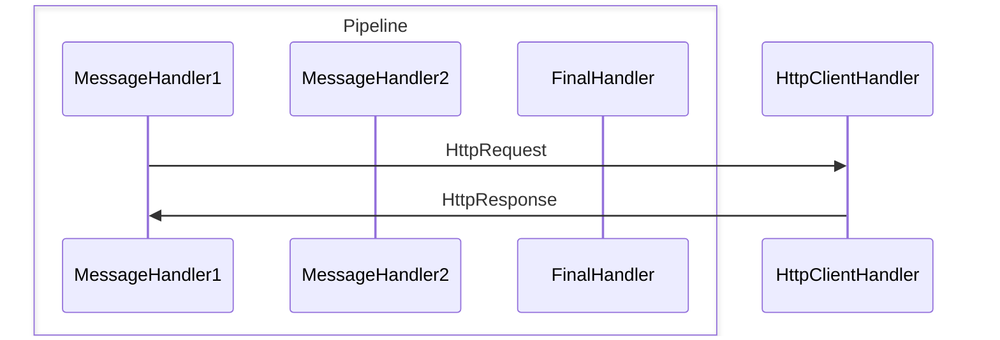

The library provides an outgoing request resiliency pipeline for `HttpClient`, using policies from the [PoliNorError](https://github.com/kolan72/PoliNorError) library.



## Key Features

- Provides the ability to create a pipeline to handle typical transient HTTP failures (including the `HttpRequestException` exception).  
- Flexible transient failure filter for the final `DelegatingHandler` in the pipeline for the response.  
- Optionally, arbitrary failure status codes or categories can be added to the final handler filter.  
- Other exception types (besides `HttpRequestException`) can also be included in the final handler filter.  
- Inclusion in the outer handler filter of any `Exception` type thrown by the inner handler is also supported.  
- Typed or named `HttpClient` can be used.  
- Targets .NET Standard 2.0.  

## Usage

1. Configure  typed or named `HttpClient`:

```csharp
services.AddHttpClient<IAskCatService, AskCatService>((sp, config) =>
	{
		...
		config.BaseAddress = new Uri(settings.BaseUri);
		...
	})...
```
, where `AskCatService` is a service that implements `IAskCatService`, with `HttpClient` or `IHttpClientFactory` injected.

2. Call the library's `IHttpClienBuilder.WithResiliencePipeline` extensions method and configure the pipeline of the `DelegatingHandler`s by calling the `AddPolicyHandler` methods with the policy you want to use in this handler:

```csharp
services.AddHttpClient<IAskCatService, AskCatService>((spForClient, client) =>
	{
			...
	})
	.WithResiliencePipeline((pb) => 
		pb
		.AddPolicyHandler(Policy1JustCreated)
		.AddPolicyHandler((IServiceProvider sp) => funcThatUsesServiceProviderToCreatePolicy(sp))
		...
	)
```
, where   
- `pb` - represents the pipeline.
- `Policy1JustCreated` - Retry or Fallback policy from the [PoliNorError](https://github.com/kolan72/PoliNorError) library.
- `funcThatUsesServiceProviderToCreatePolicy` - `Func` that uses the `IServiceProvider` to create a policy.  

There is also the `IHttpClientBuilder.WithResiliencePipeline<TContext>` extension method with an additional generic `TContext` parameter.  
This method allows you to use the `AddPolicyHandler<T>(Func<TContext, IServiceProvider, T>)` method to add a policy handler to a pipeline with an overall context parameter:
```csharp
services.AddHttpClient<IAskCatService, AskCatService>((spForClient, client) =>
	{
			...
	})
	.WithResiliencePipeline<SomeContextType>((pb) => 
		pb
		.AddPolicyHandler((SomeContextType ctx, IServiceProvider sp) => 
			funcThatUsesContextAndServiceProviderToCreatePolicy(ctx, sp))

		.AddPolicyHandler((IServiceProvider sp) => funcThatUsesServiceProviderToCreatePolicy(sp))
		...
	, context)
```
3. When you want to complete the pipeline, call the `AsFinalHandler` method for the last added handler and configure `HttpErrorFilter` to filter transient http errors (HTTP 5xx, HTTP 408, HTTP 429 and `HttpRequestException`) and/or any non-successful status codes or categories:

```csharp
services.AddHttpClient<IAskCatService, AskCatService>((sp, config) =>
	{
			...
	})
	.WithResiliencePipeline((pb) => 
		pb
		...
		.AddPolicyHandler(PolicyForFinalHandler)
		//Adds transient http errors to the response handling filter.
		.AsFinalHandler(HttpErrorFilter.HandleTransientHttpErrors())
		//Include in the filter 'SomeExceptionFromNonPipelineHandler' exceptions 
		//thrown by a non-pipeline handler (in this case)
		//.IncludeException<SomeExceptionFromNonPipelineHandler>())
	)
```
Optionally you can add any status code category to the final handler filter:
```csharp
		...
		//Also adds 5XX status codes to the response handling filter.
		.AsFinalHandler(HttpErrorFilter.HandleTransientHttpErrors().OrServerError())
		...

```
Inclusion in the outer handler filter of any `Exception` type thrown by the inner handler is also supported using the `IncludeException<TException>` method.  

4. In a service that uses `HttpClient` or `HttpClientFactory`, wrap the call to `HttpClient` in a catch block that handles the special `HttpPolicyResultException` exception. 
If the request was not successful, examine the `HttpPolicyResultException` properties in this handler for details of the response:

```csharp
try
{
	...
	using var response = await _client.GetAsync(uri, token);
	...
}
catch (OperationCanceledException oe)
{
	...
}
catch (HttpPolicyResultException hpre)
{
	//If the response status code matches the handling filter status code:
	if (hpre.HasFailedResponse)
	{
		//For example, log a failed status code.
		logger.LogError("Failed status code: {StatusCode}.", hpre.FailedResponseData.StatusCode);
	}
}
catch (Exception ex)
{
	...
}
```

## `HttpPolicyResultException` properties

Public properties of the `HttpPolicyResultException`:

- `InnerException` 
	- if the response status code matches the handling filter status code, it will be the special `FailedHttpResponseException`;  
	- otherwise - an `exception` thrown by a final handler, or by a handler in or out of the pipeline that throws its own exception, and the outer handler to that handler includes the type of that exception in its filter (using the `IncludeException<TException>` method).
- `FailedResponseData` - not null if the status code part of the handling filter matches the response status code.
- `HasFailedResponse` - true if `FailedResponseData` is not null.
- `PolicyResult` - specifies the `PolicyResult<HttpResponseMessage>` result produced by a policy of the bottom handler.  
- `InnermostPolicyResult` - specifies the `PolicyResult<HttpResponseMessage>` result produced by a policy of the final handler or by a handler in the pipeline that throws its own exception. 
- `IsErrorExpected` - indicates whether the filter for the original exception was satisfied.
- `IsCanceled` - indicates whether the execution was canceled.

## Samples

See samples folder for concrete example.

## Links And Thanks

Steve Gordon. HttpClientFactory in ASP.NET Core 2.1 (Part 3) :  
https://www.stevejgordon.co.uk/httpclientfactory-aspnetcore-outgoing-request-middleware-pipeline-delegatinghandlers  

Martin Tomka. Building resilient cloud services with .NET 8 :
https://devblogs.microsoft.com/dotnet/building-resilient-cloud-services-with-dotnet-8/

Thomas Levesque. Fun with the HttpClient pipeline :
https://thomaslevesque.com/2016/12/08/fun-with-the-httpclient-pipeline/  

Milan Jovanovic. Extending HttpClient With Delegating Handlers in ASP.NET Core :  
https://www.milanjovanovic.tech/blog/extending-httpclient-with-delegating-handlers-in-aspnetcore  

Josef Ottosson. Testing your Polly policies :  
https://josef.codes/testing-your-polly-policies/  

